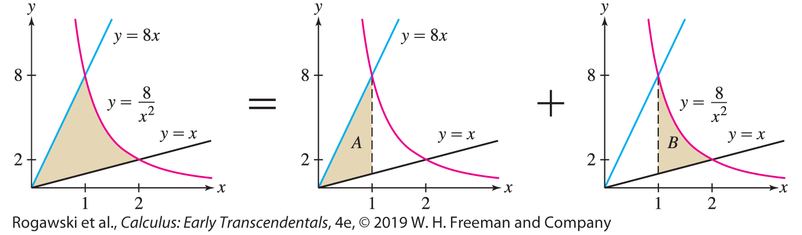
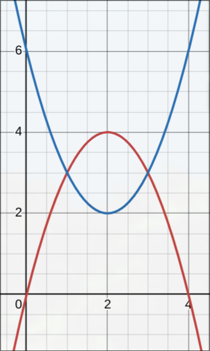

# MATH 426: Calculus 2

## Calc-1 Review

-   Derivatives
-   Integrals
-   Finding Antiderivatives
    -   $2e^2x$ = ???
-   Fundamental Theorem of Calculus Pt: 2
    -   $A(x) = \int_a^b f(x)$
    -   $A’(x) = f(x)$

For a lot of these it's just a matter of plugging in values to solve.

# Section 5.6 - Net Change Theorem

## Finding displacement

This is the more simple part of net change problems. To find displacement we just find the integral of a function over a range.

-   $\int_a^b f(x) \, dx$ - Finds displacement of f(x) over [a, b]

## Finding total change

**This is the what we really mean when talking about net change.** Basically

1. Finding displacement (Integrals)

This type of question asks to find the total displacement, or some change over a given time.
The solution of this is to just find the integral from [x, y] for the given function

Finding Total Change

First find zeros of the function.

From here you can make a line chart and which sections are positive and negative.

You can then take the integral of each section and add them up

Make sure for any negative sections you take the absolute value of the integral.

# Section 5.7 - Substitution Method (u-substitution)

A way to systematically undo the chain rule when finding antiderivatives.

Problems like this will sometimes include bounds [a, b] that are function themselves and will need to be chain ruled out

EX:

# Section 6.1 - Area Between Curves

_Note: You can find the points of intersection by setting the two equations equal to one another._

## Between Curves

Bounded by Curves
The total area under the combined functions

## Divided Regions

_Divided Regions Example_

These problems are typically more complex since you have more functions, but there not to bad.

# Section 6.2 - Integral Applications

## Finding Volume (By Cross Sections)

## Average of Functions (MVT)

_This can be represented as:_

$\frac{1}{b-a} \int_a^b f(x) \ dx$

<!-- ## Linear Density (Pipe Problems lol.) -->

--math3d.org

# Section 6.3 - Rotating Disks and Washers

The core idea of the next two chapters is about **Solids of Revolution**. These are just the 3D shapes created when rotating a function around the x or y axis.

There are 2 main types of problems we'll see:

-   Area of singular functions (Disks)
-   Area of combinded functions (Washers)

When calculating either of these its important to remember **that anything rotated around an axis, will create circular slices**

## Disk Method

The simpler of the 2 is the Disk Method. The basic idea of this, is we take the integral of circle around each point on the function.

_This can be represented as:_

$\int_a^b \pi f(x)^2 \ dx$

-   a -
-   b

**NOTE: You will use dx or dy based on which axis you rotate around.**

## Washer Method

The washer method is a similiar idea, but it instead tries to calculate the area between the circle (where the two function overlap).

**Its called a washer as the 3D shape created by overlapping functions looks like a donut**

_This can be represented ass:_

$\int_a^b \pi(f(x)^2 - g(x)^2) \ dx$

-   f(x) - Is the top function (greater one)
-   g(x) - is the bottom one (smaller)

## Adjusting for Different Axes

Sometime you'll be asked to rotate around a non-standard axis like y=2, or x=1. In these cases you will need to adjust you function to do the shell method.

Typically if the number is positive you will subtract the function from the number

x = 1

$(1 - (x^2))$

If its negative you just add the number to the functions

x = -1

$(1 + (x^2))$

# Section 6.4 - Volume with Cylindrical Shells

## Volume by Shell

$y = 4 - (x - 2)^2$

$y = (x - 2)^2 + 2$

The intersections can be found by setting them equal

$(x-2)^2 + 2 = 4 - (x - 2)^2$

$x = -1, 3$

**Using the Shell Method:**

**The main difference here is with shell your taking vertical slices (cylinders) instead of disks (Circles)**

-   We can break down the intersection into vertical cylinders

height Depends on diff x

Volume R - Volume r

_Cylinders: $\pi R^2 h - \pi r^2 h$_

$Volume = \int_a^b 2 \pi (shell height)(shell radius) dx$

**radius - is tyically the x or y (Unless you have a non-standard axis)**

**height - is typically the diffeence in two functions (or just one function)**

## Adjusting for different axis

To adjust for different axes you really only need to look at the radius.

Say you're revolving around y=8, then your radius would likely be (8-y)

If it where y=-8 though it would be (y+8)

_NOTE: this glosses over why this actually is the case lol._

# Section 7.1 - Integration by Parts

When dealing with integrals that involve multiplication (x \* y), you may need to use integration by parts (IBP).

$\int udv \ dx = uv - \int v \ du$

This can also be used for definite integrals

$\int_a^b udv \ dx = uv|_a^b - \int_a^b v \ du$

## Cyclical Problems

Sometimes you'll be given problems that seem to go on for ever. In these cases you will need to to IBP until the original integral is being subtracted.

It would end up like this

$\int uv \ dx = uv - \int uv \ dx$

You can then add that other integral to the left and then divided

$\int uv \ dx = uv/2$

# Section 7.7 - Improper Integrals

Improper integrals are just integrals that go to infinity.

EX: $\int 1/x$

We want to see if these integrals get small enough, fast enough, that we can approximate the area as a finite value. (This stuff is similiar to limits stuff we've already done)

An example of an improper integral would be calculating the velocity needed to leave earths atmosphere. (As the force of gravity decreases the farther you are from earths center)

$\int_a^b f(x) \ dx$

Is improper if:

1. **a or b goes to infinity** (type 1), or

2. **f(x) -> infinity** (type 2)

## Type 1 Integrals

We can represent type 1 integrals like so:

$\lim(R->\infin) \ \int_a^R f(x) \ dx$

**An example is shown below,**

$\lim(R->\infin) \ \int_0^R e^x \ dx$

$\lim(R->\infin) [-e^-x]|_0^R$

$[1/e^\infin - -e^0]$

$0 + 1 = 1$

This is pretty much how these problems go. Its just applying the limits stuff we learned last semster along with integrals.

**Another example,**

$\int_1^\infin 1/x^3 \ dx = [-1/2 * 1/x^2]|_1^\infin$

$lim(R->\infin) -1/2(1/R^2 - 1/1^2)$

$-1/2(0-1)= 1/2$

**Defintions:**

-   Converges - Limits involved exist
-   Diverges - Some limit involved DOES NOT EXIST (DNE)

Both examples given above Converge. An example that shows diverergance is below:

$\int_\infin^1 1/x \ dx$

$lim(R->\infin) \ ln|-1| - ln|R|$

$= -\infin$ (This DNE, but it goes towards negative infinity)

### P Integrals over [a, $\infin$]

An improper integral with $x^{-p}$

As p get bigger the fucntion get smaller. **P values are divide at p = -1, as thats where you can tell if it converges or diverges**

$\int_a^\infin 1/x^p \ dx$

-   Diverges when $p \leq 1$

-   When $p > 1$ this formula can be used

$a^{1-p}/p-1$

_As long as a > 0_

### Doubly Infinite Integrals

$\int_{-\infin}^\infin f(x) \ dx$

This can be broken down into

$\int_{-\infin}^0 f(x) \ dx + \int_0^\infin f(x) \ dx$

## Type 2 Integrals

These ones are different as they have some kind of discontinuity. The main difference here is we set the limit to the discontinuity rather than $\infin$.

On $[a, b)$

$\lim_{R-b^-} \int_a^R f(x) \ dx$

_NOTE: your only ever approaching one side of b so keep the ^+ or ^-_

### P-Integrals $[0, a)$

Yes p-integrals exist for type 2 improper integrals :sigh:

## Comparing Integrals

For some improper integrals there is no way to find its exact value. One way we can analize them is by comparing them to a function that is greater than them. The whole idea is that if a function that is always greater, converges then the original function must also converge.

EX:

$\int_1^\infin 1/{\sqrt{x}+e^{3x}} \ dx$

One way we can find another function is to find a value that is always less then the denom.

$ \geq e^{3x}$

# Section 10.1 - Sequences

A sequence ($a_n$) is a collection of number defined by a funtion $f(n)$.

We typical define them like so:

$a_n = 1/n$ (or whatever it is)

## Recursive Sequences

Sometimes we have to deal with recursive sequences. These are just sequences defined with respect to n-1. For example:

$a_n = a_{n-1} + a_{n-2}$ (Fibonacci Sequence)

## Limits of a Sequences

When a limit {$a_n$} approaches a limit we say **it converges to said limit.**

$lim_{n-\infin} \ a_n = L$

**If no limit exist we say it DIVERGES** (It can also diverge to infinity, kinda like DNE but not lol.)

The definition is that $|a_n - 1| < \epsilon$ and that $n > M$

**If ever asked to prove a sequence converges at a given limit you should plug into the first part, then isolate n**.

With n you can then write out n > M

## Bounded Sequences

A sequence can be "bounded" in two primary ways:

Bounded from Above -

Bounded from Below -

Bounded - If it is bounded both above and below~

Unbounded - It does not have no bound lol.

# Section 10.2 - Sum of Infinite Series

Nth Partial Sum

Telescoping Series

Geometric Series - Patial Sum - Full Sum

Nth Term divergence

# Section 10.3 - Convergance of Series

For any other series we come across, instead of finding the actual sum, its good enough just to determine its convergece. Below are the methods we can use to do this:

## Integral Test

Take the integral. If it diverges, then the Series also diverges. Thats it.

## P-Series

$\sum_{n=1}^\infin 1/n^p$

p > 1 - Converges

p $\leq$ 1 - Diverges

**P-Series should be memorized.**

## Comparison Tests

How do we determine convergance for summations which aren't as simple?

**Something like this:** $\sum 1/{n^2+4}$

For problems like this which are close to a format we know (ie. P-Series) we can use some tests to help us determine convergance. We have 2 main options:

### Direct Comparison Test (DCT)

**Direct Comparison Test** - Determine convergance by comparing two function ($a_n \leq b_n$)

-   If $b_n$ converges then $a_n$ converges
-   If $a_n$ diverges, then $b_n$ diverges

**EXAMPLE:**

$a_n = \sum_{n=1}^\infin 1/n2^n$

This is similiar to

$b_n = \sum_{n=1}^\infin 1/2^n$

Here $a_n \leq b_n$

$b_n$ converges as its Geometric and r=1/2

Thus $a_n$ converges through DCT

### Limit Comparison Test (LCT)

DCT doesn't always work, so we can also use the:

**Limit Comparison Test** - Using limits to prove conergance or divergence

If $lim_{n - \infin} \ a_n/b_n = c > 0$, then $a_n$ and $b_n$ diverge/converge together

#

#

#

#

# Section 10.4 - Conditional Convergance (Alternating Series)

### Absolute Convergance

A series is said to **converge absolutely** if:

$\sum |a_n|$ converges

This is important as it can be used to determin convergance for functions that alternate.

like $\sum^\infin_{n=1} -1^n$

This also implies the original function converges. (in this case $\sum a_n$)

**NOTE: THIS DOES NOT GO BOTH WAYS**

### Conditional Convergance

A function $\sum a_n$ **converges conditionally** if $\sum a_n$ converges, but $\sum |a_n|$ diverges.

Each of these become important when we discuss our next topic

## Alternating Series

An alternating is just a series thats multipled by -1 to a power. This causes it to jump from positive to negative consectutivel, which can be challenging to determin convergeance. One way we can determine convergance is throught the **Alternating Series Test**

If we say there is a function $b_n$ that is positive, and decreasing towards 0 then:

$\sum^\infin_{n=1} (-1)^{n-1} b_n$ must converge to 0

Its important to know that this **only tells us it converges conditionally**.

# Section 10.5 - Ratio Test, Root Test, etc.

### Ratio Test

The **ratio test** can be used to determine convergance of more difficult summations. It works like this:

$p = lim_{n-\infin} |{a_{n+1}}/{a_n}|$

If p < 1, then $a_n$ converges absolutely,

If p > 1, then $a_n$ diverges,

If p = 1, its inconclusive.

### Root Test

Not covered lol.

# Section 10.6 - Power Series

### Radius of Power Series

We define a power series as the form:

$F(x) = \sum^\infin_{n=0} a_n(x - c)^n$

Where c is refered to as the center of the series.

You can sub in x to create any number of power series.

In these series, for some x values the series will converge and others it will diverge. We can map how a power-series converges or diverges by looking at its **radius**.

$R = Radius$

$|x-c| < R$ - Converges absolutely

$|x-c| > R$ - Diverges

### Interval of Convergance

We can use this radius to find the **interval of convergance**

This is just the interval from $(c-R,\ c+R)$ where the function converges.

This R value can either be a finite numer $R \geq 0$ or $\infin$. If the R value exists the rules above apply to its interval.

To solve a power series we need to find its interval of convergence which require 2 steps:

1. Find the Radius of Convergance (R)
2. Check convergance at endpoints

One way we can find the Radius is using the ratio test

## Finding Radius with Ratio Test

Given a series you will want to perform the ratio test as normal.

$\sum^\infin_{n=0} (\frac{x}{3})^n$

$\rho = lim_{n-\infin} | x/3 | < 1$

From here you should get an absolute value of the answer which needs to be less than 1 for the function to converge (remember p from the ratio test). From here you just need to solve the inequality for x to get your R value.

$|x| < 3$

$R = 3$

We can then use this to calculate our bounds. As they will be $(c-R, \ c+R)$

**NOTE: To determine if the bounds will be () or [] you should plug in the bounds for X in the orginal Series**

$\sum^\infin_{n=0} (\frac{-3}{3})^n$

and

$\sum^\infin_{n=0} (\frac{3}{3})^n$

In this case both diverge so they would be (-3, 3), but if they did converge you would want to use []

## Function Expansion

There is a specific format you can use to convert a function in power series form. This is shown below:

$\frac{1}{1-x} = \sum^\infin_{n=0} x^n$

## Derivatives of Power Series

We can take the derivative of power series by differentiating **term by term**. This actually just means differentiating a grouping like $(x-c)^n$ since anything with n (like $a_n$) is treated as a constant in this context.

$f(x) = \sum^\infin_{n=1} x^n$

$f'(x) = \sum^\infin_{n=1} nx^{n-1}$

### General Problems

Typically Deriving Power Series are used in problems where we want to find the power series of another similiar function. In this case we would be **given a function f(x) which can be expanded into Power Series form**, and then asked to **find the power series for its derivative**.

EX:

# Section 10.7 - Taylor Polynomials

These are partial sums of Taylor Series. Basically we can represent a function as a power series so we can easily approximate it. This section looks at polynomials (which are partial sums, not to infinity). In the next section we look at approximation of function towards infinity with taylor series.

In Calculus 1 **we discussed linearization**, which is the process of approximating a function around a value. These where **first order approximations**, as they are at the first derivative of the function.

\*\*A taylor polynomial/series is just the summation of a bunach of linearizations at increasing orders (derivatives).

$T_0 = f(a)$

$T_1 = f(a) + f'(a)(x-a)$

$T_2 = f(a) + f'(a)(x-a) + 1/2f''(x)(x-a)^2 \ ...$ (and so on)

**We can represent these summations as the recursive sequence:**

$T_n(x) = T_{n-1}(x) + \frac{f^{(n)}(a)}{n!}(x-a)^n$

## Table Method

One way to solve these sorts of problems for exact values (1, 2, 3, etc.) is to use a table like shown below:

| $n$ | $f^n(x)$ | $f^n(c)$ | $\frac{f^n(c)}{n!}(x-c)^n$ |
| --- | -------- | -------- | -------------------------- |
| 0   | f(x)     | f(c)     |                            |
| 1   | f'(x)    |          |                            |

### Important Series

These are important to know, and you should probably have them memorized.

$e^x = \sum^\infin_{n=0} \frac{e^c}{n!}(x-c)^n$

$sin(x) = \sum^\infin_{n=0} \frac{(-1)^n}{(2n+1)!}x^{2n+1}$

$cos(x) = \sum^\infin_{n=0} \frac{(-1)^n}{(2n)!}x^{2n}$

## Calculating Error (Error Bounds)

In its most basic form:

$error = |f(x) - T_n(x)|$

When it comes to determining the error of a given taylor polynomial we want to find the maximum error, which is the highest possible deviation for the given the x, and a values.

$|f(x) - T_n(x)| \leq K \frac{|x-a|^{n+1}}{(n+1)!}$

In this formula K represent the maximum of $f^{n+1}(u)$ where you is either x or a. The K value we plug in we need to be the largest of the two:

$K = max \ f^{n+1}(u)$, We want to find the largest value K can be for the range u.

$u = [x, a]$

# Section 10.8 - Taylor Series

Taylor _Series_ are pretty similiar to the polynomials discussed above, but now $n = \infin$. The general format is shown below:

$f(x) = \sum^\infin_{n=0} \frac{f^n(c)}{n!} (x-c)^n$

Often times with these kinds of problems we'll be asked to find the value for $T_n$ which in this case would equal our summation.

## Validity of Taylor Series

This is the

## Approximate Integrals with Taylor Series

Approximating integrals really just builds on the basic taylor series we've already covered. **In its most basic form all we're doing is getting the Taylor series of the function inside of the integral, and then getting the integral of the x portion.**

$\int^1_0 f(x) = \sum^\infin_{n=0} \frac{f^n(a)}{n!} * \int^1_0 (x-a)^n$

This works because **the summation part is effectively a constant, and we can just pull it out of the integral.** From here we just get the integral and multiply it back in to get our answer.

## Solving Limits of Trig Function w/ Taylor Series

## Euler's Formula

# Section 7.2 - Trig Integrals

When dealing with integrals of various trig functions, we will often need to combine trig identitie (from pre-calc) with u-sub or IBP to solve these sorts of problems.

$\int sin^m(x) cos^n(x) \ dx$

Where m & n are whole numbers

This is the typical format for these kinds of problems. We'll have some combination of trig functions to some power. These can be broken up into sin & cos problems, or tan & sec problems.

## Sin(x) & Cos(x)

These are problems in the following form:

$sin^m(x)cos^n(x)$

These problems can be solved by the looking at the m and n values like so:

**m is odd:** Take off one sin(x) out and convert the rest to $1-cos^2(x)$

**n is odd:** Take off one cos(x) and convert the rest to $1-sin^2(x)$

**m and n are even:** Whichever one is smaller should be converted into the other using pythag Identity.

## Tan(x) & Sec(x)

These are problems in the following form:

$tan^m(x)sec^n(x)$

These problems can be solved by the looking at the m and n values like so:

**n is even:**

**m is even, n is odd:**

## Useful Identities

Below are some useful trig identities that will often come up with these sorts of problems:

**Pythagorean Intetity:**

$sin^2(x) + cos^2(x) = 1$

$sec^2(x) - tan^2(x) = 1$

**Double Angle Identities: (Power Reduction)**

$sin^2(x) = \frac{1 - cos(2x)}{2}$

$cos^2(x) = \frac{1 + cos(2x)}{2}$

# Section 7.3 - Trig Substitution

The general idea behind trig sub, is substituting in trig functions to help integrate problems involving square roots. They will typically come in forms like:

$\sqrt{a^2 - x^2}$

$\sqrt{x^2 + a^2}$

$\sqrt{x^2 - a^2}$

To solve thses problems we will remove the root by subbing in a trig function.

## Finding Trig Functions for X

The first step when doing trig sub is to find a Trig Substitution for your x value. To do this it primarily depends on what form the root is in. Some of the basic forms are detailed below:

### Form 1: $\sqrt{x^2 - a}$

## Plugging X Back In

Once you've solved the integral with respect to $\theta$ you next may need to plug x back in. To do this

### Representing as Right Triangle

These relationships can be drawn out in the form of a right triangle. Take something like this for example:

## Solving Different Roots (ie. $x^{3/2}$)

Sometimes the problem your solving isn't in one of the forms mentioned above, but you still need to do trig sub. To deal with this we can break these down into some root to a power:

$(x^2 + 4)^{3/2} = (\sqrt{x^2 + 4})^3$

From here you can do out the function normally.

# Section 7.5 - Partial Fraction Decompisition

Partial fraction decompisition is **the process we can use to find the integral of a polynomial over a polynomial.** The general idea is that we can convert a rational function, into a bunch of smaller rational functions we can derive.

$\frac{1}{x^2-1} = \frac{1}{(x-1)(x+1)}=\frac{A}{(x-1)} + \frac{B}{(x+1)}$

## Finding A, B, C, ... Values

The main challenge of partial fraction decomp, comes from finding these numerator value (A, B, C, etc.). To do this we have 2 main methods which are detailed below:

### Undetermined Coefficients:

Using this method we set the numerator equal to A + B times the denominators like so:

$Numerator = (x-1)A + (x+1)B$

From here we can multiply out and we can use the relationship between the variables to find there value. (This is usually harder than value substitution)

EX:

### Value Substitution:

# Section 11.1 - Parametric Functions & Curves
